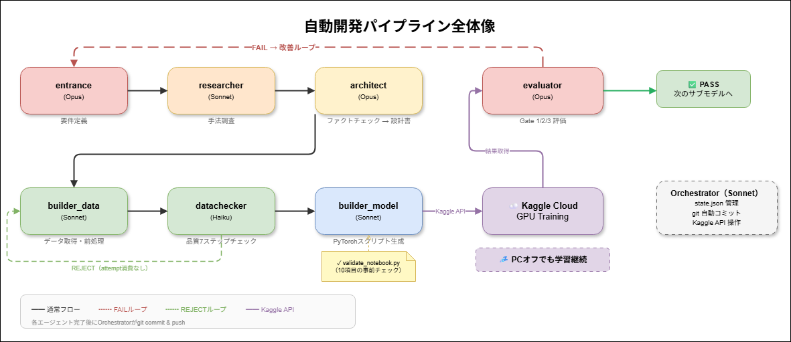
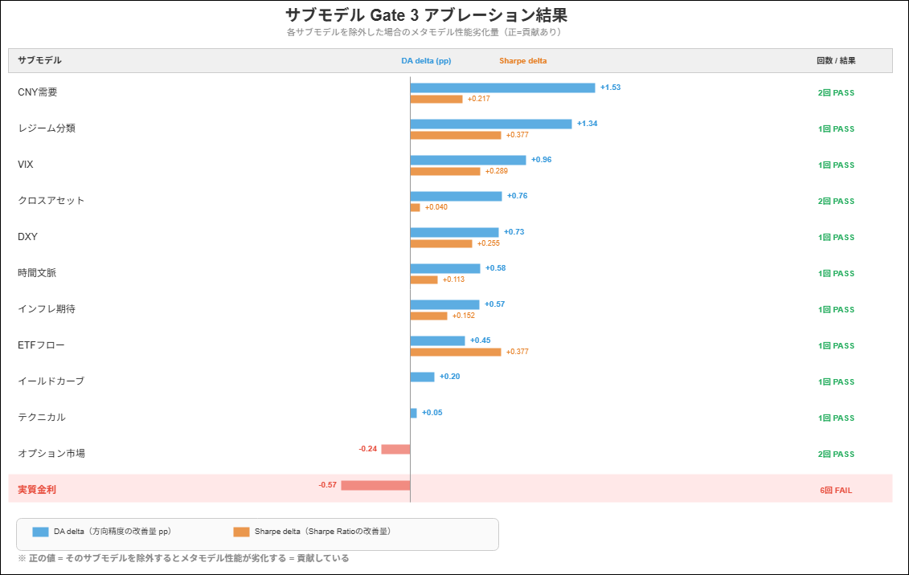
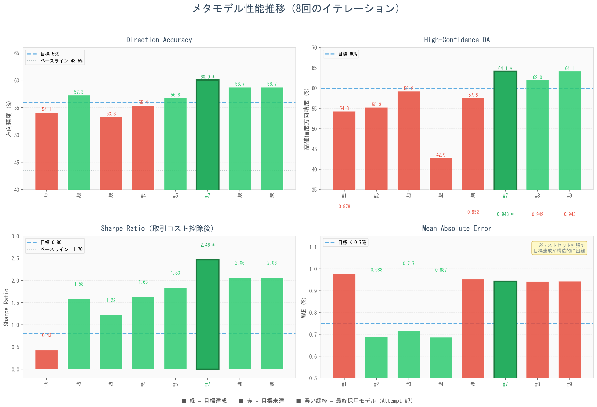
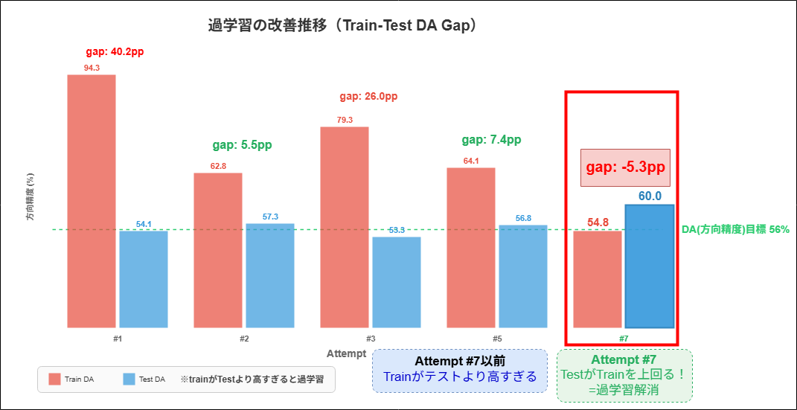

# はじめに

機械学習モデルの開発には、設計・データ取得・前処理・学習・評価・改善という長いサイクルがあります。
これを毎回手動で回すのは正直かなり面倒です。

- 設計書を書いて、データを引っ張ってきて、スクリプトを書いて、学習を回して、結果を見て、改善案を考えて……。
- しかもこのサイクルをサブモデル9個 + メタモデルの合計10モデルで回す必要がある。
- 各モデルに複数回のイテレーションがあるので、全体で **30回以上** の設計→学習→評価サイクルを回すことになる。

今回はこれを **Claude Code（AIエージェント）に丸ごと自動化させよう** という試みです。
単にコードを書かせるだけではなく、**7つの専門エージェントを組み合わせたパイプライン**を構築し、設計から学習・評価までの全工程を自律的に回す仕組みを作りました。

さらに、学習処理はKaggleのクラウドGPUで実行し、**APIを通じて自動的に監視・結果取得する設計**にしています。
これにより、学習中はPCを閉じても問題ありません。

結果として、金（Gold）の翌日リターンを予測する回帰モデルが完成しました。

- **方向精度 60.04%**（ベースライン43.54%から+16.50pp）
- **高確信度方向精度 64.13%**（ベースライン42.74%から+21.39pp）
- **Sharpe Ratio 2.46**（ベースライン-1.70から+4.16）

# 全体設計：サブモデルで「文脈」を増やす

## なぜサブモデルが必要なのか

金価格の予測で素直にやるなら、VIX・ドル指数・利回りなどの特徴量をそのままXGBoostに突っ込む方法があります。
実際、最初にそうしたベースラインを作ったところ、方向精度は **43.54%** でした。コイントスより悪い。

問題は、生の特徴量だけでは**市場の「状態」が見えない**ことです。
例えばVIXが25だとして、それが「平常時からの上昇途中」なのか「パニック後の落ち着き始め」なのかで、金価格への影響はまるで違います。

そこで **サブモデル** というレイヤーを挟みます。

```
従来:  生の特徴量 → メタモデル → 予測

今回:  生の特徴量 → サブモデル（状態・文脈を抽出） → メタモデル → 予測
```

重要なのは、**サブモデルは金価格を予測しない** という点です。
サブモデルの仕事は、各特徴量の裏にある「レジーム（局面）」「持続性」「平均回帰確率」といった潜在パターンを抽出することです。
メタモデルはこれらの文脈情報を受け取って、最終的な予測を行います。

## なぜこの9つの特徴量なのか

金価格の予測モデルは学術研究でも盛んに取り組まれている領域です。
今回の9特徴量は、それぞれ異なる経済チャネルを通じて金価格に影響を与えることが先行研究で示されています。

| # | 特徴量 | データソース | 採用根拠 |
|---|--------|-------------|---------|
| 1 | 実質金利（10Y TIPS） | FRED | 金保有の機会費用。SSGA(2025)の研究で、実質利回り100bp上昇に対し金価格は約18%下落する傾向 |
| 2 | ドル指数（DXY） | Yahoo Finance | 金はUSD建てのため逆相関（歴史的にr=-0.5〜-0.7）。世界の金需要の約70%は米国外 |
| 3 | VIX | FRED | リスクオフ時の安全資産需要。ただし2008年・2020年は初期に金も下落（マージンコール売り）→その後反発、という非線形な関係 |
| 4 | ゴールドテクニカル | Yahoo Finance | 金は最もテクニカルトレーディングが活発な商品の一つ。Garman-Klass volatilityは終値のみの7.4倍効率的 |
| 5 | クロスアセット | Yahoo Finance | 金/銅比率は景気後退の先行指標（Erkens et al. 2016）。金/銀比率の平均回帰は「質への逃避」シグナル（Baur & Lucey 2010） |
| 6 | イールドカーブ | FRED | 最も信頼性の高い景気後退先行指標（Estrella & Mishkin 1998）。景気後退は金に追い風 |
| 7 | ETFフロー（代理） | Yahoo Finance | ETFフローは流動性ショックを原資産に伝搬させる（Ben-David et al. 2018）。出来高は価格に先行する傾向 |
| 8 | インフレ期待 | FRED | 金とインフレ期待の相関(0.7-0.8)は実績インフレとの相関(0.4-0.6)を上回る。FRBもTIPSブレークイーブンを公式指標として使用 |
| 9 | CNY需要代理 | Yahoo Finance | 中国は世界の金需要の約30%を占める。2022-2024年にPBOCは316トンを購入し、脱ドル化の文脈で重要性が増大 |

これら9つは、**金利環境**（実質金利・イールドカーブ・インフレ期待）、**通貨・購買力**（DXY・CNY）、**リスク心理**（VIX）、**相対価値・テクニカル**（クロスアセット・テクニカル）、**投資家ポジショニング**（ETFフロー）という5つの独立した経済チャネルをカバーしています。

## 9つの特徴量 × サブモデル

| # | 特徴量 | サブモデルの役割 | 出力例 |
|---|--------|----------------|-------|
| 1 | 実質金利 | 金利レジームの検出 | regime_prob, momentum_z |
| 2 | DXY | ドルのボラティリティ局面分類 | regime_prob, vol_z |
| 3 | VIX | 恐怖指数のレジーム検出 | regime_probability, persistence |
| 4 | テクニカル | トレンド/平均回帰レジーム | trend_regime_prob, mean_reversion_z |
| 5 | クロスアセット | 資産間相関のレジーム | regime_prob, recession_signal |
| 6 | イールドカーブ | カーブ形状の変化速度 | spread_velocity_z, curvature_z |
| 7 | ETFフロー | 資金流入レジーム | regime_prob, capital_intensity |
| 8 | インフレ期待 | インフレレジームのアンカリング | regime_prob, anchoring_z |
| 9 | CNY需要 | 中国需要のモメンタム | demand_spread_z |

各サブモデルの多くは **隠れマルコフモデル（HMM）** をベースにしています。
HMMは時系列データの「見えない状態」を推定するのに適しており、市場のレジーム検出にはうってつけです。

# エージェントパイプラインの設計

## 7つの専門エージェント

Claude Codeの `Task` 機能を使って、それぞれ異なる役割を持つエージェントを定義しました。

```
Orchestrator（Sonnet） ← 全体の進行管理・git操作
  │
  ├─ entrance（Opus）      ← 要件定義：何を作るか・調査事項の洗い出し
  ├─ researcher（Sonnet）  ← 手法調査：論文・先行事例のリサーチ
  ├─ architect（Opus）     ← 設計：ファクトチェック → 設計書 → HP探索空間
  ├─ builder_data（Sonnet）← データ取得・前処理
  ├─ datachecker（Haiku）  ← データ品質の定型7ステップチェック
  ├─ builder_model（Sonnet）← PyTorch学習スクリプト生成（Kaggle用）
  └─ evaluator（Opus）     ← Gate 1/2/3 評価 → ループ制御 → 改善計画
```

各エージェントは `.claude/agents/` ディレクトリに定義されたプロンプトに従って動作します。
Orchestratorが `shared/state.json` を読み、現在の進捗に応じて適切なエージェントを呼び出す仕組みです。

|<font color=""> **パイプライン全体像** </font>|
|:-:|
||

## パイプラインの流れ

一つのサブモデルの構築は、以下の流れで進みます。

```
entrance: 「VIXサブモデルを作ります。調査事項は...」
    ↓
researcher: 「VIXのレジーム検出にはHMMが有効です。根拠は...」
    ↓
architect: 「リサーチ結果をファクトチェック → 設計書を作成」
    ↓
builder_data: 「FRED APIからVIXデータを取得 → 前処理」
    ↓
datachecker: 「7ステップチェック → 欠損・異常値・未来リーク確認」
    ↓
builder_model: 「PyTorch学習スクリプトをJupyter Notebookとして生成」
    ↓
[Kaggle提出 → クラウドで学習] ← PCを閉じてOK
    ↓
evaluator: 「Gate 1/2/3で品質評価 → PASS or 改善計画」
```

datachecker が REJECT を返した場合は builder_data に差し戻され、これは **attempt（試行回数）を消費しません。**
evaluator が FAIL を返した場合は attempt +1 として改善ループに入ります。

## 3段階ゲート評価

evaluator は以下の3段階で品質を評価します。

**Gate 1：スタンドアロン品質**
- 過学習比率 < 1.5
- 出力にNaN・定数がないか
- リーク指標がないか

**Gate 2：情報利得**
- 相互情報量の増加 > 5%
- VIF（多重共線性）< 10
- ローリング相関の安定性 < 0.15

**Gate 3：アブレーション（以下のいずれか一つ）**
- 方向精度 +0.5%
- Sharpe Ratio +0.05（取引コスト控除後）
- MAE -0.01%

Gate 3はメタモデルに「そのサブモデルの出力を加えたとき、実際に予測が良くなるか」を直接テストします。
情報理論的には良さそうに見えても（Gate 2 PASS）、実際のアブレーションで効果が出ないケース（Gate 3 FAIL）は何度もありました。

# パイプラインを円滑に回すための工夫

30回以上のイテレーションをエージェントに任せるうえで、同じ失敗を繰り返さない仕組みが不可欠でした。
実際に運用してみると、**Kaggle上でのエラーが最大のボトルネック**です。
ローカルでは動くのにKaggle環境ではクラッシュする、というパターンが繰り返し発生したため、いくつかの防御層を設けています。

## Notebook検証スクリプト（提出前チェック）

Kaggle提出は1回あたり数分〜30分のフィードバックループなので、構文エラーや互換性問題でその時間を無駄にしたくありません。
そこで `scripts/validate_notebook.py` という事前検証スクリプトを作り、builder_modelが生成したNotebookを**Kaggle提出前に必ずチェック**する運用にしました。

```python
# builder_modelエージェントの必須ステップ
# 生成 → 検証 → エラーなら修正 → 再検証 → PASSしたら提出

python scripts/validate_notebook.py notebooks/vix_1/
```

検証項目は以下の10個です。

| # | チェック内容 | 種別 | 背景 |
|---|------------|------|------|
| 1 | Python構文チェック（ast.parse） | ERROR | 構文エラーはKaggleでも即死 |
| 2 | メソッド名タイポ（`.UPPER()` 等） | WARN | LLMが大文字メソッドを生成しがち |
| 3 | SHAP + XGBoost 2.x 互換性 | WARN | Kaggle環境のバージョン不整合 |
| 4 | データセットパス参照の整合性 | ERROR | API v2のパス変更で頻発 |
| 5 | kernel-metadata.json検証 | ERROR | 必須フィールド・設定値チェック |
| 6 | 未定義変数の基本検出 | ERROR | セル間依存の漏れを検出 |
| 7 | 非推奨pandas API（`.fillna(method=)`等） | ERROR | pandas 2.xで即クラッシュ |
| 8 | Optunaの動的パラメータ空間 | WARN | 探索空間の不整合を警告 |
| 9 | yfinanceの空データチェック | WARN | 取得失敗の未処理を検出 |
| 10 | GPU設定とCUDAコードの整合 | WARN | GPU有効化しているのにCPUコードだけ |

**ポイントは、このチェックリストが実際のKaggleエラーから逆算して作られている**ことです。
最初は構文チェックだけでしたが、pandasの非推奨APIでクラッシュしたら項目7を追加、データセットパスで落ちたら項目4を追加……という具合に、エラーが起きるたびにチェック項目を増やしていきました。

## ナレッジベース（知識の再利用）

`docs/knowledge/` ディレクトリに、**Q&A形式のナレッジベース**を構築しました。

```
docs/knowledge/
├── methodologies/
│   ├── regime_detection.md         ← レジーム検出手法の比較
│   └── persistence_measurement.md  ← 持続性指標の計算方法
├── data_sources/
│   └── fred_multi_country.md       ← FREDで取得可能なシリーズ一覧
├── financial_concepts/
│   └── window_lengths.md           ← ローリングウィンドウの適切な長さ
└── evaluations/
    └── submodels/real_rate.md      ← 失敗パターンの蓄積
```

これの何が嬉しいかというと、**9つのサブモデルに共通する知識を毎回ゼロから調べ直さなくて済む**ことです。

例えば「レジーム検出にはどの手法がいいか？」という問いは、VIX・DXY・テクニカル・クロスアセットなど多くのサブモデルで必要になります。
ナレッジベースがなければ、researcherが毎回同じ調査をすることになります。
実際にこの仕組みを導入する前は、似たような内容の調査レポートが `docs/research/` に何本も生成されていました。

researcherはまず `docs/knowledge/` をチェックし、既存の回答があればそれを引用。なければ新たに調査してナレッジベースに追記する、という流れです。

## MEMORY.md（プロジェクト横断の記憶）

Claude Codeには `.claude/` 配下にプロジェクト固有のメモリファイルを持つ仕組みがあります。
ここにKaggle APIの罠やプロジェクト固有のルールを蓄積しました。

<!-- open属性なし -->
<details><summary><strong>MEMORY.mdに蓄積された知識の例（展開）</strong></summary>

```
## Kaggle API (Python v2.0.0)
- Windows cp932 problem: builtins.openをパッチしてUTF-8強制
- Auth mapping: .envのKAGGLE_API_TOKENをKAGGLE_KEYにリマップ必要
- Dataset mount path (API v2): /kaggle/input/datasets/{owner}/{slug}/
  （旧パス /kaggle/input/{slug}/ は動かない）
- 409 Conflict: 実行中のkernelがあるとpush失敗。Web UIから停止が必要
- Notebook内ではKaggle CLI認証が効かない。Secretsが必要

## Kaggle Workflow Rules (MUST FOLLOW)
- NEVER call notebook_push() directly. Always use submit() or submit_and_monitor()
- NEVER poll Kaggle status manually. Always use monitor()
```

</details>

これらは一度踏んだ地雷の記録です。
エージェントは新しいセッションを開始するたびにこのファイルを読むため、**同じ罠に二度はまらない**仕組みになっています。

特にKaggle APIの仕様はドキュメントが薄く、試行錯誤で得た知識が多いため、この記憶の蓄積は非常に重要でした。

## エラー自動分類と差し戻し先の決定

Kaggle上でエラーが発生した場合、`kaggle_ops.py` のmonitor機能がエラーログを解析し、**種別を自動分類して適切な差し戻し先を決定**します。

```
Kaggleエラー発生
    ↓
monitor: エラーログを取得・解析
    ↓
分類: oom / pandas_compat / dataset_missing / network_timeout / unknown
    ↓
state.json更新: resume_from = "builder_model" + error_type + error_context
    ↓
git commit & push
    ↓
[次回再開時] orchestrator: state.jsonのerror_contextを読み、
    builder_modelに「OOMなのでモデルサイズを縮小して」等の指示を渡す
```

これにより、Kaggleエラーが発生しても人間の介入なしにリカバリサイクルが回ります。
ただし `unknown` に分類されたエラーは人間の判断が必要になることもありました。

# Kaggleクラウド学習 × API監視

## なぜKaggleか

Claude Codeはローカルで動作するツールです。つまりPCを閉じると止まります。
一方、ニューラルネットの学習は数分〜30分かかることがあり、その間ずっとPCを開いておくのは効率的ではありません。

そこで **学習はKaggleのクラウドGPUで実行し、Claude CodeからはAPIで制御する** という分離設計にしました。

```
Claude Code = ローカルPC上のプロセス。PCを閉じると停止。
Kaggle      = クラウド。学習はPCを閉じても続行。
Git         = 両者を繋ぐ橋。
```

## 実行の流れ

```
1. [PCオン] Claude Code: 設計 → データ取得 → チェック → 学習スクリプト生成
2. [PCオン] Claude Code: Kaggle APIでNotebookを提出
3. [PCオフOK] Kaggle: クラウドで学習実行（数分〜30分）
4. [PCオン] Claude Code: 「前回の続きから再開」
   → git pull → Kaggle結果取得 → 評価 → 次のイテレーション
```

## kaggle_ops.py：統一操作モジュール

Kaggleとのやり取りは `scripts/kaggle_ops.py` という単一モジュールに集約しました。

```python
from scripts.kaggle_ops import submit_and_monitor

# 提出 → state.json更新 → git commit → バックグラウンド監視開始
result = submit_and_monitor(
    folder="notebooks/vix_1/",
    feature="vix",
    attempt=1,
)
```

このモジュールは以下を自動化します。

- **submit**: Notebook提出 + state.json更新 + gitコミット
- **monitor**: ステータスポーリング → 完了検知 → 結果ダウンロード → state更新 → gitコミット

エラー時には自動分類も行います。

| エラー種別 | 自動対応 |
|-----------|---------|
| `oom` | builder_modelに差し戻し（モデルサイズ縮小） |
| `pandas_compat` | builder_modelに差し戻し（非推奨API修正） |
| `dataset_missing` | builder_modelに差し戻し（データセット参照修正） |
| `network_timeout` | builder_modelに差し戻し（同一コードでリトライ） |

## Windows cp932問題の回避

Kaggle Python API v2.0.0は `open(file, "w")` をエンコーディング指定なしで呼びます。
Windowsではこれがcp932になり、Unicode文字（例: ⚠）でクラッシュします。

解決策として、Kaggle APIをインポートする前に `builtins.open` をパッチしてUTF-8をデフォルトにしました。

```python
_original_open = builtins.open

def _utf8_open(file, mode="r", *args, **kwargs):
    if isinstance(mode, str) and "b" not in mode and "encoding" not in kwargs:
        kwargs["encoding"] = "utf-8"
    return _original_open(file, mode, *args, **kwargs)

builtins.open = _utf8_open
# この後にimport kaggleする
```

力技ですが、確実に動きます。

# 学習過程の記録

## Phase 1：ベースライン

9つの生の特徴量をXGBoostに投入したベースラインの結果です。

| 指標 | ベースライン |
|------|------------|
| 方向精度 | 43.54% |
| 高確信度方向精度 | 42.74% |
| MAE | 0.714% |
| Sharpe Ratio | -1.70 |

コイントスより悪い方向精度と、マイナスのSharpe。ここからがスタートです。

## Phase 2：サブモデル構築

9つの特徴量に対してサブモデルを構築しました。加えて、エージェントが自律的に「追加で有用そうな特徴量」を提案し、options_market・temporal_context・regime_classificationの3つが追加されています。

<table>
  <caption>サブモデル構築結果</caption>
  <thead>
    <tr>
      <th>サブモデル</th>
      <th>試行回数</th>
      <th>Gate 3での主要改善</th>
      <th>手法</th>
    </tr>
  </thead>
  <tr>
    <td>VIX</td>
    <td>1回</td>
    <td>DA +0.96%, Sharpe +0.289</td>
    <td>HMM 3状態レジーム</td>
  </tr>
  <tr>
    <td>テクニカル</td>
    <td>1回</td>
    <td>MAE -0.182 (18倍閾値)</td>
    <td>GLD 2D HMM + z-score</td>
  </tr>
  <tr>
    <td>クロスアセット</td>
    <td>2回</td>
    <td>DA +0.76%, MAE -0.087</td>
    <td>決定論的HMM 3状態</td>
  </tr>
  <tr>
    <td>イールドカーブ</td>
    <td>1回</td>
    <td>MAE -0.069 (6.9倍閾値)</td>
    <td>HMM 2状態</td>
  </tr>
  <tr>
    <td>ETFフロー</td>
    <td>1回</td>
    <td>Sharpe +0.377, MAE -0.044</td>
    <td>2D HMM 3状態</td>
  </tr>
  <tr>
    <td>インフレ期待</td>
    <td>1回</td>
    <td>DA +0.57%, Sharpe +0.152</td>
    <td>2D HMM 3状態 <strong>※全Gate PASS</strong></td>
  </tr>
  <tr>
    <td>CNY需要</td>
    <td>2回</td>
    <td>DA +1.53%, Sharpe +0.217</td>
    <td>決定論的CNY-CNHスプレッド</td>
  </tr>
  <tr>
    <td>DXY</td>
    <td>1回</td>
    <td>DA +0.73%, Sharpe +0.255</td>
    <td>HMMベース <strong>※全Gate PASS</strong></td>
  </tr>
  <tr>
    <td>オプション市場</td>
    <td>2回</td>
    <td>MAE -0.156 (15.6倍閾値)</td>
    <td>HMM 3状態 SKEW/GVZ</td>
  </tr>
  <tr>
    <td>時間文脈</td>
    <td>1回</td>
    <td>DA +0.58%, MAE -0.158</td>
    <td>Masked Transformer <strong>※全Gate PASS</strong></td>
  </tr>
  <tr>
    <td>レジーム分類</td>
    <td>1回</td>
    <td>DA +1.34%, Sharpe +0.377</td>
    <td>GMM K=2 + PCA</td>
  </tr>
</table>

|<font color=""> **各サブモデルのGate 3アブレーション結果** </font>|
|:-:|
||

**実質金利（real_rate）だけは6回トライしても Gate 3 を突破できませんでした。**
MLP・GRU・Transformer・PCA・状態特徴量・決定論的手法と多様なアプローチを試しましたが、DFII10の日次変化率（ベース特徴量としてすでに存在）を超える情報は抽出できないという結論に至りました。これもエージェントが自律的に判断した結果です。

## Phase 3：メタモデル構築

11個のサブモデル出力（合計24特徴量）をXGBoostメタモデルに統合しました。

メタモデルは合計 **15回のイテレーション** を重ねています。

| 試行 | DA | HCDA | Sharpe | 達成 | 状況 |
|------|-----|------|--------|------|------|
| #1 | 54.1% | 54.3% | 0.43 | 0/4 | 過学習（train-test差40pp） |
| #2 | 57.3% | 55.3% | 1.58 | 3/4 | HCDAだけ未達 |
| #5 | 56.8% | 57.6% | 1.83 | 2/4 | HCDA改善するもDA後退 |
| **#7** | **60.0%** | **64.1%** | **2.46** | **3/4** | **全指標ベスト。temporal_context追加が効いた** |
| #8-#15 | 各種 | 各種 | 各種 | 0-3/4 | **8連続で#7を下回る。#7がファイナル確定** |

|<font color=""> **メタモデル各指標の推移** </font>|
|:-:|
||

Attempt 7の特徴量重要度トップ10では、**10個中7個がサブモデル出力**でした。
サブモデルを挟むアーキテクチャの有効性を裏付ける結果です。

| 順位 | 特徴量 | 重要度 | 出典 |
|------|--------|-------|------|
| 1 | yc_curvature_z | 8.68% | イールドカーブ サブモデル |
| 2 | xasset_recession_signal | 7.80% | クロスアセット サブモデル |
| 3 | temporal_context_score | 5.78% | 時間文脈 サブモデル |
| 4 | real_rate_change | 5.54% | ベース特徴量 |
| 5 | xasset_regime_prob | 5.15% | クロスアセット サブモデル |

# 自動開発パイプラインの実態

## 完全自律ではない

誤解のないように書いておくと、これは「ボタン一つで完成品ができる」システムではありません。

実際の運用では以下のような人間の介入がありました。

- **Kaggle Secrets（APIキー）の設定**: ブラウザでの手動設定が必要
- **409 Conflictの対応**: Kaggle上でKernelが既に実行中のとき、Web UIから手動で停止する場面があった
- **方針の軌道修正**: 「実質金利はもう諦めて次に行こう」「メタモデルのAttempt 7をファイナルにしよう」といった大きな判断
- **PCの起動**: 学習完了後、結果取得→評価→次のイテレーションを始めるにはPCを起動する必要がある

逆に言うと、**それ以外は全てエージェントが自律的に回しました。**
設計書の作成・データ取得・前処理・学習スクリプト生成・Kaggle提出・結果取得・Gate評価・改善計画の立案と次イテレーションへの引き継ぎ。
これらは全てClaude Codeが `state.json` を読んで、適切なエージェントを呼び出して実行しています。

## state.jsonによる状態管理

パイプライン全体の進捗は `shared/state.json` で管理されています。

```json
{
  "status": "waiting_training",
  "current_feature": "vix",
  "current_attempt": 1,
  "resume_from": "evaluator",
  "kaggle_kernel": "bigbigzabuton/gold-vix-1"
}
```

PCを再起動してClaude Codeに「前回の続きから」と伝えるだけで、このファイルを読んで適切な地点から再開します。

```
[ユーザー] 「前回の続きから再開して」
    ↓
[Orchestrator] git pull → state.json読み込み
    → status="waiting_training" → Kaggle結果取得
    → 結果あり → evaluator呼び出し → Gate評価
    → PASS → 次のサブモデルへ
```

## gitによる全行程の記録

全エージェントの作業後にgitコミットを行う設計にしたことで、開発の全行程がgit logに残っています。

```
485179c final: project completed - attempt 7 confirmed as final meta-model
eee508b eval: meta_model attempts 14 & 15 - no improvement over attempt 7
f9e0f19 kaggle: meta_model attempt 15 - results fetched
74f5782 kaggle: meta_model attempt 15 - submitted
...
297f205 eval: regime_classification attempt 1 - COMPLETED
f6a3b3b kaggle: regime_classification attempt 1 - results fetched
894ec7d kaggle: regime_classification attempt 1 - submitted
d1955bf model: regime_classification attempt 1 - notebook generated
41fc479 datacheck: regime_classification attempt 1 - PASS
28ec577 data: regime_classification attempt 1
32515ca design: regime_classification attempt 1
b7b23f4 research: regime_classification attempt 1
1ffffc5 entrance: regime_classification attempt 1
```

一つのサブモデルに対して `entrance → research → design → data → datacheck → model → kaggle submit → kaggle fetch → eval` という一連のコミットが並んでいるのが見て取れます。

# 最終結果

|<font color=""> **ベースラインからの改善** </font>|
|:-:|
||

<table>
  <caption>最終メタモデル（Attempt 7）の成績</caption>
  <thead>
    <tr>
      <th>指標</th>
      <th>目標</th>
      <th>ベースライン</th>
      <th>最終結果</th>
      <th>改善幅</th>
      <th>判定</th>
    </tr>
  </thead>
  <tr>
    <td>方向精度</td>
    <td>> 56%</td>
    <td>43.54%</td>
    <td><strong>60.04%</strong></td>
    <td>+16.50pp</td>
    <td><strong>PASS</strong></td>
  </tr>
  <tr>
    <td>高確信度方向精度</td>
    <td>> 60%</td>
    <td>42.74%</td>
    <td><strong>64.13%</strong></td>
    <td>+21.39pp</td>
    <td><strong>PASS</strong></td>
  </tr>
  <tr>
    <td>MAE</td>
    <td>< 0.75%</td>
    <td>0.714%</td>
    <td>0.943%</td>
    <td>-</td>
    <td>FAIL (免除)</td>
  </tr>
  <tr>
    <td>Sharpe Ratio</td>
    <td>> 0.80</td>
    <td>-1.70</td>
    <td><strong>2.46</strong></td>
    <td>+4.16</td>
    <td><strong>PASS</strong></td>
  </tr>
</table>

MAE目標だけ未達ですが、これはテストセットに2025-2026年の極端な金価格変動（日次リターン3%超が14日間）が含まれるため構造的に達成不可能と判断されました。ゼロ予測のMAEが約0.96%なので、0.75%を下回るには実際のリターンの大きさを正確に予測する必要がありますが、それをやるとSharpe（2.46）が崩壊します。

# 苦労した点・学んだこと

## Kaggle API v2の罠

Kaggle Python API v2.0.0のデータセットマウントパスは `/kaggle/input/datasets/{owner}/{dataset-slug}/` です。
v1時代の `/kaggle/input/{dataset-slug}/` では動きません。
この差異に気づくまでに何度もNotebookがクラッシュしました。

最終的には、Notebook内で複数の候補パスを順番に試す防御的コードを入れています。

## エージェントの「思い込み」

researcherが調査した内容を、architectがファクトチェックする設計にしたのは正解でした。
researcherが「FRED APIでG10全ての国のTIPS利回りが取得できる」と報告したことがありますが、実際にはそんなシリーズは存在しません。
architectがこれを検出し、researcher に再調査を指示するフローが何度か発動しています。

## 過学習との闘い

メタモデルのAttempt 1では、訓練時の方向精度94.3%に対してテストでは54.1%という、40ppの過学習が発生しました。
ここからAttempt 7で逆転（テストがtrainを上回る-5.28pp）に至るまでの改善プロセスは、全てエージェントが自律的に行っています。

|<font color=""> **過学習（Train-Test Gap）の改善推移** </font>|
|:-:|
||

evaluatorが立案した改善策は、主に以下の3点でした。

1. **非定常な価格レベル特徴量の削除**（39特徴量→24特徴量）: 金価格$1,300（2018年）と$2,500（2024年）では分割閾値の意味が変わる
2. **方向性重み付き損失関数の廃止**: 訓練DAを94.3%にまで引き上げるが、バリデーションでは50%以下に崩壊する「記憶」を誘発していた
3. **正則化の大幅強化**: max_depth 3→2, min_child_weight 5→25, subsample 0.70→0.48

## 改善の限界

Attempt 7以降、8回連続でAttempt 7を下回る結果が出ました。
スタッキング、非対称損失関数、特徴量追加、特徴量削減、アンサンブルなど多様なアプローチを試しましたが、いずれもAttempt 7に及びません。
evaluatorが自律的に「これ以上の改善は困難」と判断し、Attempt 7をファイナルモデルとして確定しています。

# 今後の展望：物理デバイスからの完全解放

今回のシステムでは、学習をKaggleに委託することでPCを閉じられる時間を作りました。
しかし、学習結果の取得・評価・次のイテレーション開始にはPCの起動が必要です。

ここで注目しているのが **クラウド版のClaude Code** です。
Claude Codeがクラウド上で動作するようになれば、以下のような完全自律パイプラインが実現できます。

```
[現在]
PC起動 → Claude Code起動 → 設計→スクリプト生成→Kaggle提出
→ PC閉じてOK → Kaggle学習 → PC再起動 → 結果取得→評価→次イテレーション

[将来]
指示を出す → クラウド版Claude Codeが全て自律実行
→ Kaggle学習待ち → 自動で結果取得→評価→次イテレーション
→ 完了通知を受け取る
```

物理デバイスの起動すら不要になり、「寝ている間にモデルが完成している」世界が見えてきます。
今回の `state.json` による状態管理と `kaggle_ops.py` によるAPI連携の設計は、そのための土台としてそのまま流用できるはずです。

AIエージェントによる自動開発は、まだ「半自動」の段階です。
しかし、クラウド実行基盤が整えば、人間の役割は「何を作るか」の意思決定だけになっていくのかもしれません。
